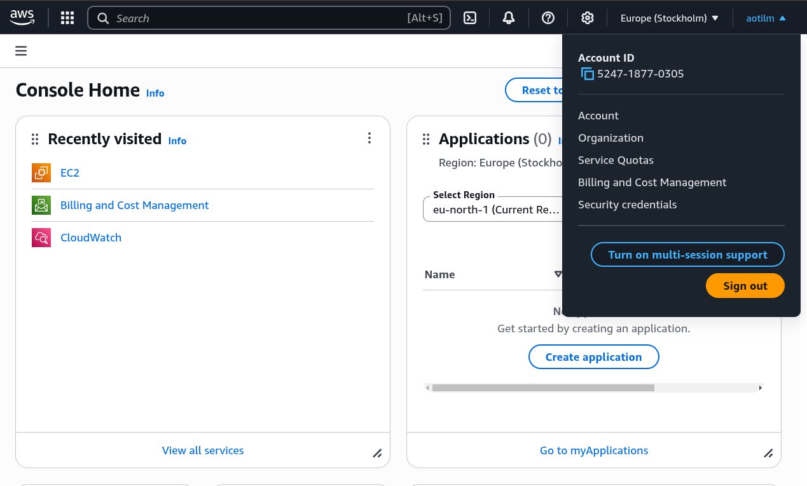
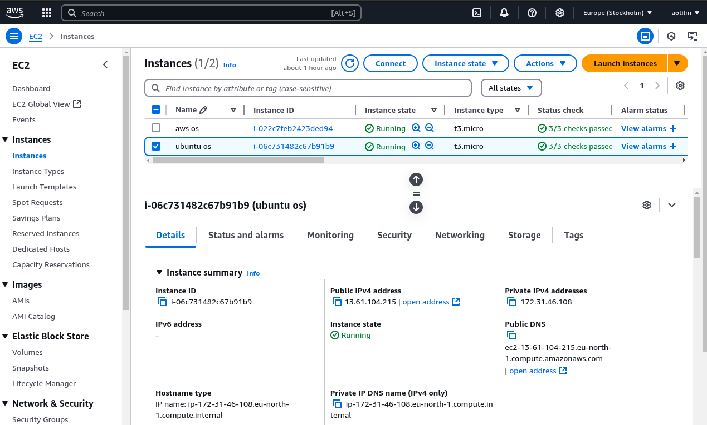
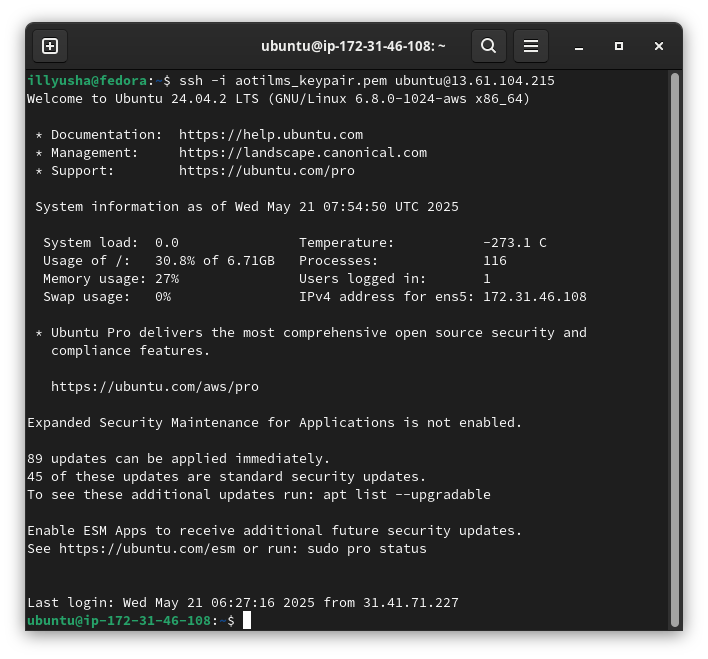
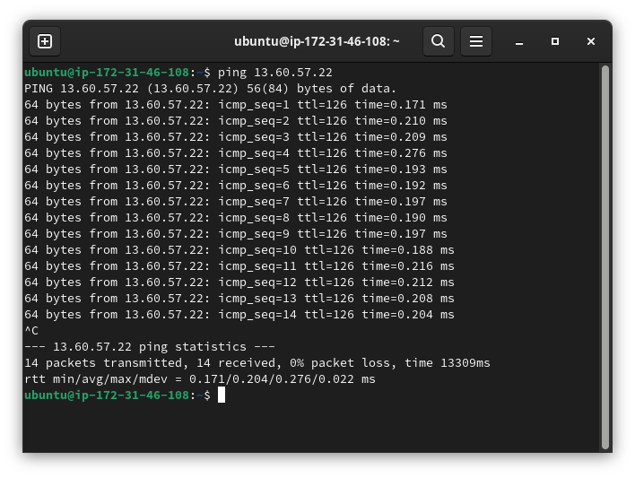
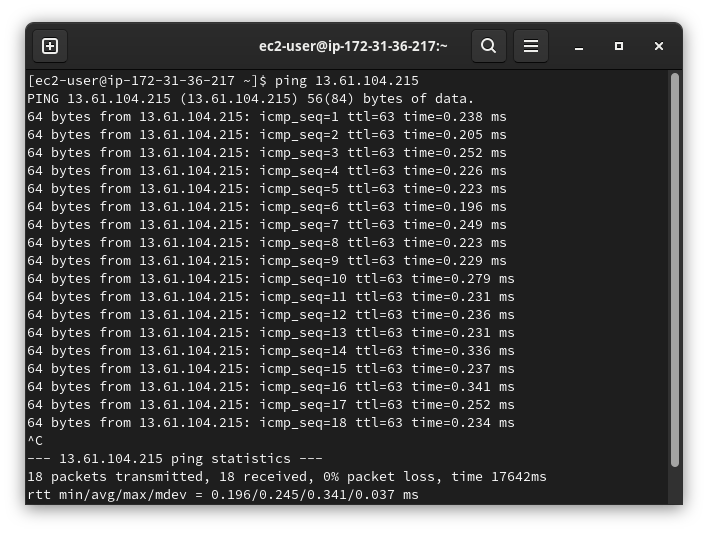
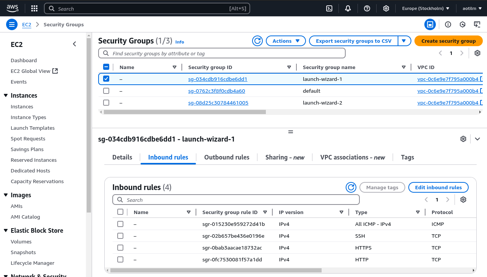
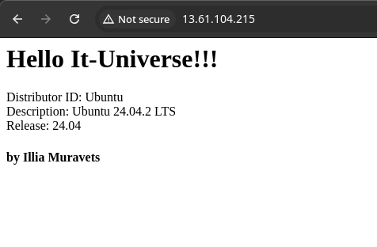
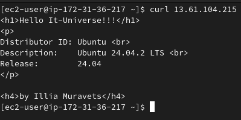

# Завдання 2

## 1. Реєстрація та ознайомлення
* Зареєструйтесь на aws.amazon.com.
* Озн     айомтесь з головною панеллю (AWS Console).
* Перейдіть у розділ Billing і перевірте, як відслідковувати витрати.




## 2. Створіть EC2 інстанси
* Створіть 2 EC2 інстанси типу t2.micro з різними ОС (Amazon Linux, Ubuntu).
* Попрактикуйтесь зупиняти, перезапускати, видаляти, створювати інстанси.




## 3. SSH-з’єднання
* Підключіться до одного інстансу через SSH з вашого локального комп’ютера.
* Занотуйте IP-адресу, яку використано для з’єднання.



## 4. Зв’язок між інстансами
* Налаштуйте SSH і ping між інстансами.
Створіть підключення через SSH ключі з одного інстансу до іншого (і навпаки).

<!-- ### Ubuntu instance -->
```
ssh -i aotilms_keypair.pem ubuntu@13.61.104.215 //підключення до ubuntu instance
ssh-keygen -t rsa -b 2048 -f ~/.ssh/id_rsa //генерування rsa ключа 
cat ~/.ssh/id_rsa.pub //перегляд згенерованого публічного ключа
```

```
ssh -i aotilms_keypair.pem ec2-user@13.60.57.22 //підключення до amazon os
nano ~/.ssh/authorized_keys //копіювання публічного ключа з Ubuntu instance
```
* SSH зв'язок з Amazon instance до Ubuntu робиться аналогічно




* Налаштування Security group, відкриття портів



## 5. Встановіть веб-сервер
* “Hello World”
* Інформація про версію ОС
* На одному інстансі встановіть Nginx або Apache.
* Створіть просту сторінку з текстом:
* Переконайтесь, що сторінка доступна через браузер з інтернету.
* На другому інстансі перевірте цю сторінку через curl або інші засоби.

* Встановлення Apache та заміна сторінки заглушки
```
sudo apt install apache2 
sudo rm -rf /var/www/html/index.html //видалення сторінки за замовчуванням
sudo nano /var/www/html/index.html  //заповнення нової
```



* перевірка з Amazon instance



