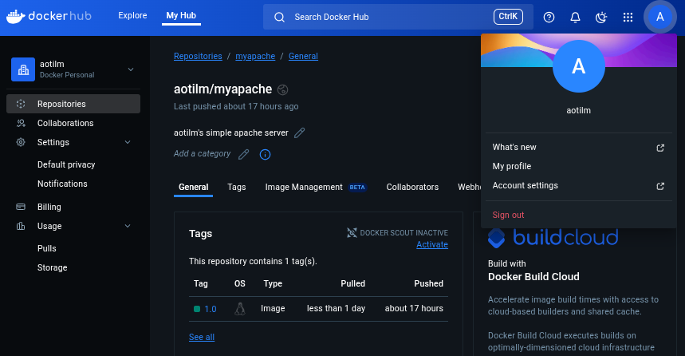

# Завдання 4

## Встановити Docker
* Встановіть Docker на віртуальну машину або хмарний інстанс.
* EXTRA 1.1: Напишіть [Bash-скрипт](ubuntu_docker_install.sh) для автоматичного встановлення Docker.

## Перший контейнер
* Завантажте та запустіть офіційний Docker-образ hello-world.


* Ознайомтесь із базовими командами docker run, docker pull, docker ps, тощо.
* EXTRA 2.1: Використайте образ з HTML-сторінкою, відредагуйте її, додавши текст: <Ім'я_користувача> Sandbox 2021.

***
Завантаження та запуск контейнера httpd
```
docker run -d -p 80:80 --name apacheCont httpd // де "-d" - для фонової роботи контейнера, "-p" - проброс порту
```
Аби контейнер працював на стандартному http порту необхідно зупинити служби які його займають
```
systemctl stop apache2 // на старому instance працює apache
```

Редагування HTML-сторінки 
```
docker exec -it apacheCont bash // вхід у контейнер
apt update && apt install nano // оновлення репозиторіїв та встановлення nano
nano htdocs/index.html // редагування сторінки
```


* [Лог процесу виконання у терміналі](first-container-log)
---

## Dockerfile
* Створіть власний Dockerfile для збирання образу з веб-додатком (nginx / apache / httpd).
* Додаток має бути вбудований у Docker-образ (тобто знаходитися в контейнері).
* EXTRA 3.1.1: Використовуйте базові образи (ubuntu, alpine, centos).
* Додайте змінну середовища DEVOPS=<username> у ваш образ.
* EXTRA 3.2.1: Змусьте веб-сторінку відображати значення цієї змінної. Якщо значення зміниться — після перезапуску контейнера веб-сторінка повинна оновитися.

***
* [Опис створення образу](./docker_compose/apache_container/Dockerfile)
* [Додатковий скрипт для вставки занчення змінної](./docker_compose/apache_container/script.sh)
* [Лог створення образу](./docker_compose/apache_container/docker_image_log.txt)


Результат:
```
docker run -d -p 80:80 --name my_apache aotilm/my_apache // без вказування значення змінної
docker run -d -p 80:80 -e DEVOPS=aotilm  --name my_apache aotilm/my_apache // з ключем -e для встановлення значення змінної
```
**вставка в останньому рядку*


---

## Docker Hub
* Завантажте свій образ на публічний репозиторій на ваш вибір та додайте опис.

***
Вивантаження створеного образу на Docker Hub
``` sh
docker login // логін на docker hub
docker tag my_apache aotlim/my_apache:1.0 // створення тегу або версії образу
docker push aotlim/my_apache:1.0 // вивантаження docker hub
```



* *[Профіль Docker Hub](https://hub.docker.com/u/aotilm)*
---

* EXTRA 4.1: Інтегруйте GitHub-репозиторій із докер репозиторієм(якщо можливо). Налаштуйте автоматичне створення образів після кожного push. 

## Docker Compose
* N копій вашого власного образу (для розуміння реплік)
* будь-який Java-додаток
* базу даних (MySQL / PostgreSQL / MongoDB тощо)
* Створіть docker-compose.yml, який розгортає кілька контейнерів:
* Java-додаток має запускатися лише після повного запуску БД
* EXTRA 5.1: Використовуйте .env файли для налаштування кожного сервісу.

***
Створені images apache та java додатку

``` 
$ sudo docker images
REPOSITORY                 TAG       IMAGE ID       CREATED        SIZE
java_server                latest    eb6fe3adab49   2 hours ago    487MB
aotilm/myapache            latest    828872b2b1c6   3 hours ago    234MB
mysql                      latest    edbdd97bf78b   6 weeks ago    859MB
hello-world                latest    74cc54e27dc4   4 months ago   10.1kB

```
**додатково створювався Dockerfile для збірки [образу з Java додатком](./docker_compose/java_container/Dockerfile)*

**Запуск файлу docker-compose.yml**
* У випадку якщо запускається кілька реплік apache на один порт - виникає проблема зайнятості порта
```
sudo docker compose up -d
```

бачимо помилку яка означає, що оддна з реплік вже зайняла порт

```
Error response from daemon: failed to set up container networking: driver failed programming external connectivity on endpoint docker_compose-apache-2 (1858e66804b8a4fbad5b6fdfb9aef65f32f2baa905edd55394bae43a5b010f73): failed to bind host port for 0.0.0.0:80:172.18.0.2:80/tcp: address already in use
```

проте одна репліка все ж буде працювати

```
$ docker compose ps -a
NAME                      IMAGE                      COMMAND                  SERVICE     CREATED          STATUS          PORTS
docker_compose-apache-1   docker_compose-apache      "/script.sh"             apache      22 seconds ago   Up 21 seconds   0.0.0.0:80->80/tcp, [::]:80->80/tcp
docker_compose-apache-2   docker_compose-apache      "/script.sh"             apache      22 seconds ago   Created         
docker_compose-apache-3   docker_compose-apache      "/script.sh"             apache      22 seconds ago   Created         
java_cont                 docker_compose-java_cont   "java -jar server.jar"   java_cont   21 seconds ago   Up 21 seconds   
mysql_cont                mysql                      "docker-entrypoint.s…"   db          22 seconds ago   Up 21 seconds   3306/tcp, 33060/tcp

```

* Щоб вручну не вказувати порт для кожної репліки у yaml файлі, треба використовувати сервіс який буде слідкувати за перенаправленням трафіку apache
* Для цього використано Docker Swarm 

```
docker swarm init // ініціалізація Docker Swarm
docker stack deploy --compose-file docker-compose.yml my_stack // запуск docker-compose.yml через swarm
```

*Лог створеного стеку*

```
$ docker stack services my_stack
ID             NAME                 MODE         REPLICAS   IMAGE                    PORTS
fo4wzr69slcw   my_stack_apache      replicated   3/3        aotilm/myapache:latest   *:80->80/tcp
v7xqtxlye4de   my_stack_db          replicated   1/1        mysql:latest             
vd6g91raswvn   my_stack_java_cont   replicated   1/1        java_server:latest  
```

*Лог процесів сервісу  apache*

```
$ docker service ps my_stack_apache
ID             NAME                IMAGE                    NODE      DESIRED STATE   CURRENT STATE               ERROR     PORTS
f4exjfutn5y9   my_stack_apache.1   aotilm/myapache:latest   fedora    Running         Running about an hour ago             
l8cip5mxfthe   my_stack_apache.2   aotilm/myapache:latest   fedora    Running         Running about an hour ago             
o5s5bae0w6x8   my_stack_apache.3   aotilm/myapache:latest   fedora    Running         Running about an hour ago  
```

* В результаті отримуємо розподілення навантаження по репліках завдяки docker swamp, де відкрито лише один порт 

***
### Файли:

* [docker-compose.yml](./docker_compose/docker-compose.yml)

* [apache Dockerfile](./docker_compose/apache_container/Dockerfile)

* [java Dockerfile](./docker_compose/java_container/Dockerfile)

* *у випадку використання swarm не працюють змінні з [.env](./docker_compose/.env)*

---
---